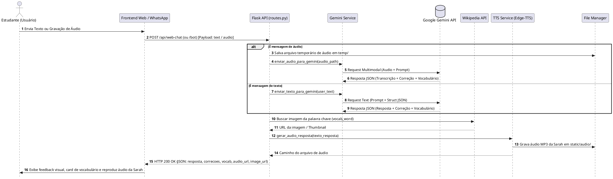
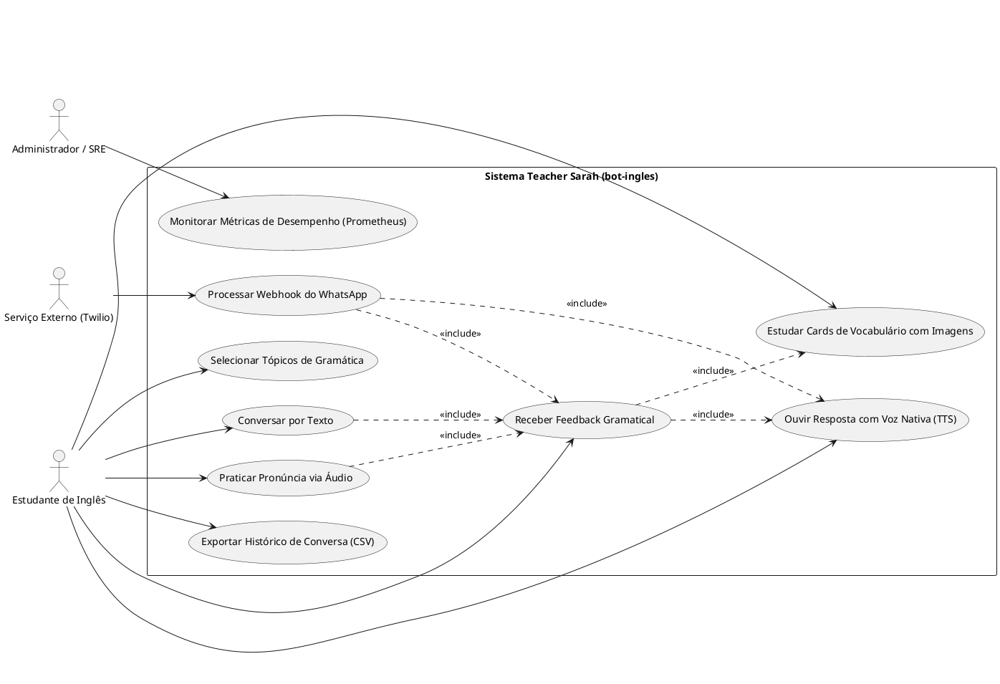
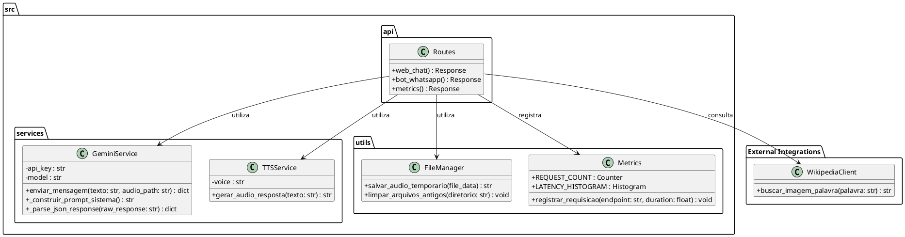
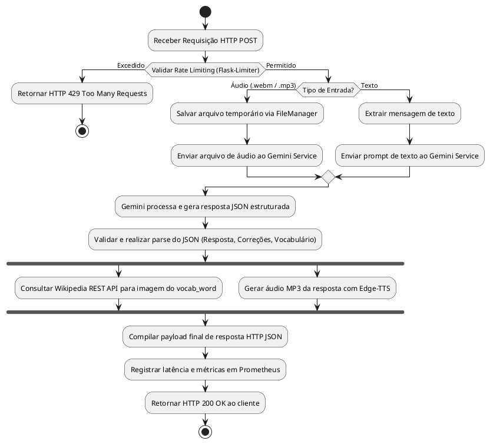
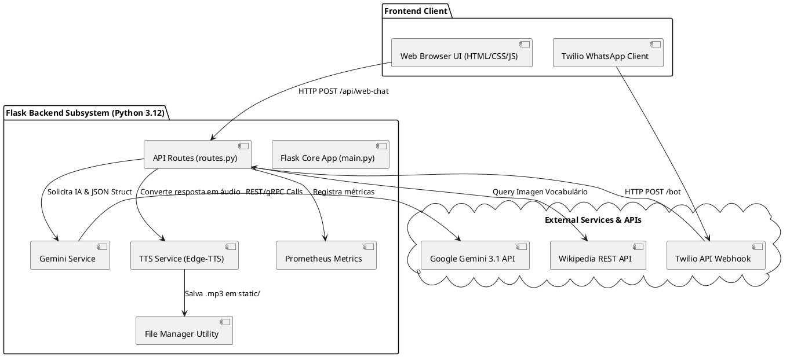
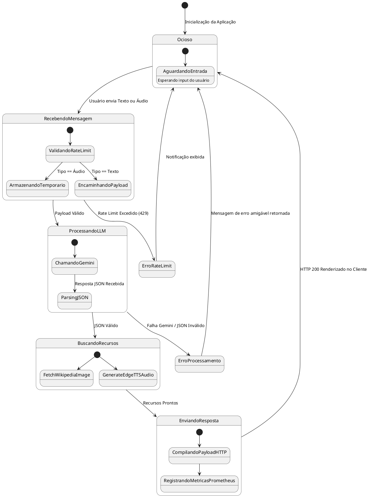
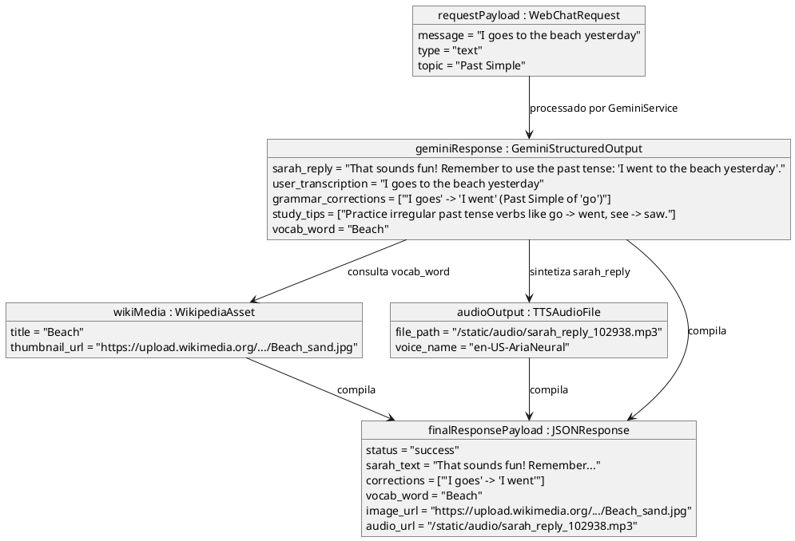
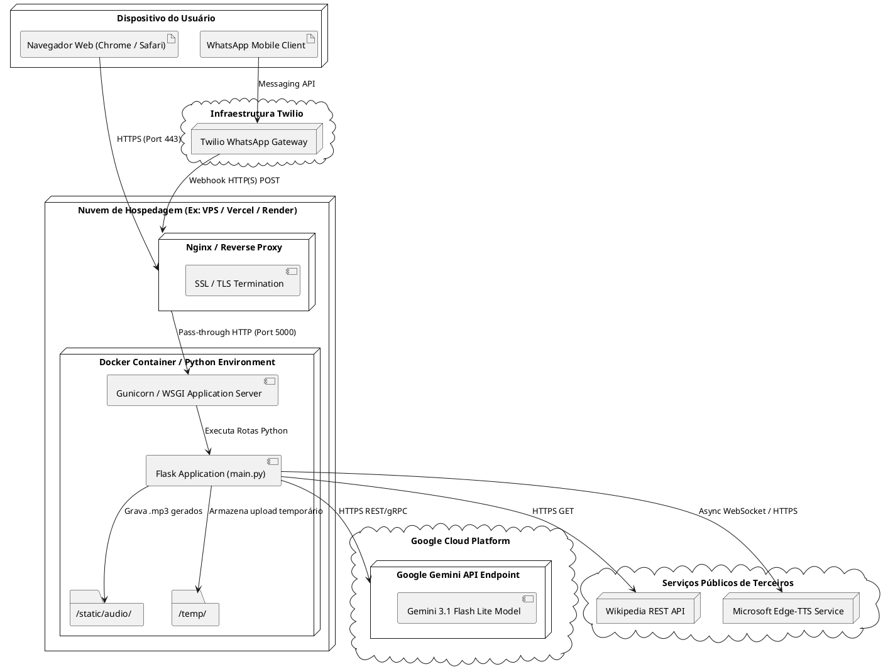
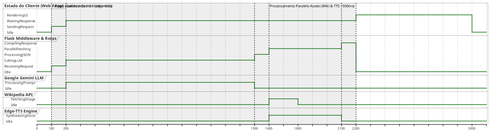

# Architecture Documentation

## Overview
Teacher Sarah (bot-ingles) é uma aplicação Flask completa para o ensino e prática de inglês com IA, servindo duas plataformas principais:
1. **Web-Chat Interativo:** Frontend em HTML/CSS (Glassmorphism) e JS conectando ao endpoint `/api/web-chat` em `src/api/routes.py`.
2. **Integração WhatsApp:** Endpoint `/bot` em `src/api/routes.py` integrado com Twilio Webhook.

---

## Core Components
- **API (routes.py):** Rotas principais e orquestração (recebe mensagens, envia para a IA e retorna o resultado).
- **Gemini Service (`src/services/gemini_service.py`):** Encapsula chamadas ao Google Gemini. Transcreve áudios do usuário, analisa gramática, gera respostas contextualizadas e extrai vocabulário via JSON Schema.
- **TTS Service (`src/services/tts_service.py`):** Converte a resposta de texto da IA para voz sintética de altíssima qualidade (Microsoft Edge-TTS).
- **File Manager (`src/utils/file_manager.py`):** Gerencia arquivos temporários em `temp/` e static audio em `static/audio/`.
- **Metrics (`src/utils/metrics.py`):** Expõe métricas Prometheus em `/metrics`.

---

## Rate Limiting
Utiliza `Flask-Limiter` em `main.py` baseado no IP para prevenir abuso sem impactar a experiência de conversação contínua.

---

## Software Engineering Diagrams (UML / PlantUML)

Todos os diagramas abaixo foram modelados em PlantUML e estão armazenados na pasta [`docs/diagrams/`](file:///c:/Users/mathe/bot-ingles/docs/diagrams/).

### 1. Diagrama de Sequência (`sequence_diagram.puml`)
Descreve a troca de mensagens em tempo real entre o Cliente (Web/WhatsApp), a Flask API e as APIs externas (Gemini, Wikipedia, Edge-TTS).

---

### 2. Diagrama de Caso de Uso (`use_case_diagram.puml`)
Define as funcionalidades oferecidas aos usuários finais e administradores do sistema.

---

### 3. Diagrama de Classe / Módulos (`class_diagram.puml`)
Apresenta a estrutura de classes, módulos e dependências do backend Python.

---

### 4. Diagrama de Atividade (`activity_diagram.puml`)
Ilustra o fluxo de controle interno do pipeline de processamento do Flask.

---

### 5. Diagrama de Componentes (`component_diagram.puml`)
Demonstra a arquitetura modular e os limites dos subsistemas.

---

### 6. Diagrama de Estado (`state_diagram.puml`)
Representa os estados possíveis de uma transação de mensagem.

---

### 7. Diagrama de Objeto (`object_diagram.puml`)
Representa instâncias reais de objetos de dados trocados em runtime.

---

### 8. Diagrama de Implantação (`deployment_diagram.puml`)
Mapeia os nós de hardware/software, containers e gateways em produção.

---

### 9. Diagrama de Tempo (`timing_diagram.puml`)
Exibe o perfil temporal de execução e latência das etapas da aplicação.

